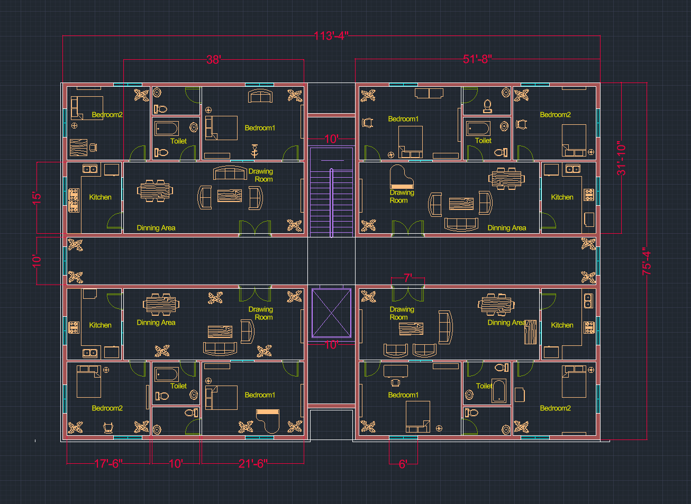
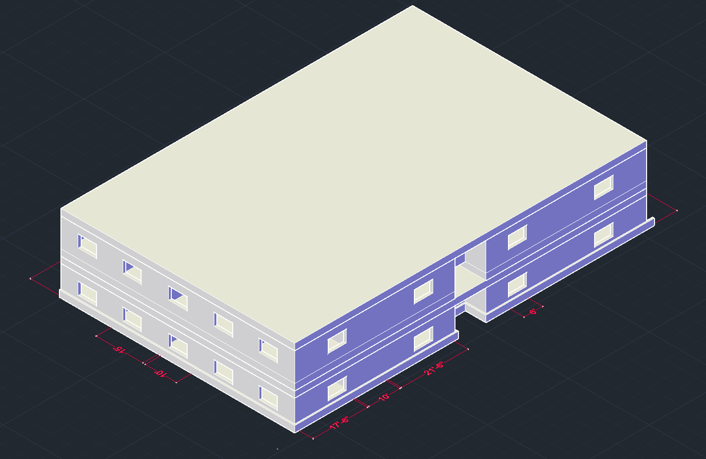
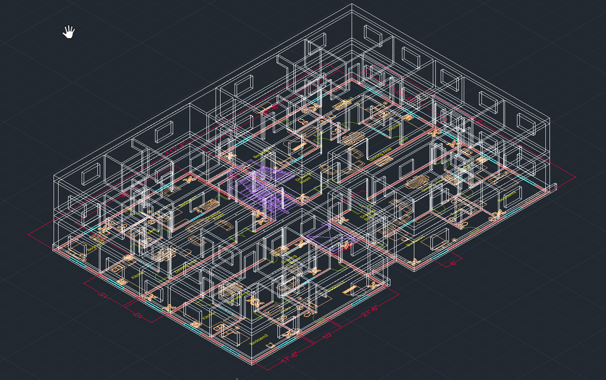

# Four-Unit Residential Layout

This repository contains the **Four-Unit Residential Layout** project, created as part of the **CSE200: Computer-Aided Engineering Drawing** course at **East West University** (Spring 2025).  

## 👥 Contributors

The project was developed in collaboration by:
- **Muin Hossain Ratul** – East West University  
  - [GitHub](https://github.com/MuinRatul)  
  - [LinkedIn](https://www.linkedin.com/in/mh-ratul-5201792a9/)  

- **Fayaza Islam** – East West University  
  - [GitHub]()  
  - [LinkedIn](https://www.linkedin.com/in/fayaza-islam-365177371/)  

---

## 📂 Contents
- `project.bak` → AutoCAD backup file containing the residential layout design  
- `AutoCad Project Report.pdf` → Project report with design details, explanations, and diagrams  

---

## 🏠 Project Overview
The project presents a **4-unit residential building floor plan** designed using AutoCAD.  

---

## 🖼️ Screenshots

### 2D Layout

### 3D Layout

---

### Features of Each Unit
- 2 Bedrooms  
- Drawing room  
- Dining area  
- Kitchen  
- Shared toilet/bathroom  

### Design Highlights
- **Symmetrical layout** for uniformity  
- **Central staircase & ventilation shaft** ensuring proper light and air circulation  
- **Efficient space utilization** for practical living  
- Suitable for **multi-family housing, rental apartments, or small complexes**  

---

## 🔧 How to View
1. Open the `.bak` file in **AutoCAD** (or compatible CAD software).  
2. Refer to the project report (`AutoCad Project Report.pdf`) for detailed explanations, design process, and 2D/3D views.  

---

## 🎯 Purpose
This project was completed as part of the **CSE200: Computer-Aided Engineering Drawing** course under the guidance of **Md Sabbir Hossain**.  
It demonstrates practical application of AutoCAD in residential building design, focusing on both **technical drawing skills** and **architectural planning**.  

---

